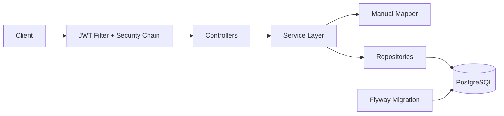

# CareerPilot API

A production-ready Spring Boot 3 backend for tracking job applications with JWT authentication, role-based access control, PostgreSQL persistence, and Dockerized deployment.

> Repository technical name: `job-application-tracker-api`

## Why This Project

CareerPilot API demonstrates practical backend engineering patterns used in real production services:

- Clean layered architecture
- Secure stateless authentication (JWT + BCrypt)
- Role-based and ownership-based authorization
- Query-driven business analytics endpoint
- Strong automated test coverage
- Container-first deployment workflow

## Core Features

- Auth endpoints:
  - `POST /api/auth/register`
  - `POST /api/auth/login`
- Job Application CRUD:
  - `GET /api/jobs`
  - `POST /api/jobs`
  - `PUT /api/jobs/{id}`
  - `DELETE /api/jobs/{id}`
- Job analytics:
  - `GET /api/jobs/stats`
- Pagination, filtering by status, sorting by applied date
- User ownership restrictions and admin-level global access
- Unified API error model via global exception handler
- OpenAPI + Swagger UI
- Flyway-based production schema migrations

## Tech Stack

- Java 17
- Spring Boot 3.3.x
- Spring Security
- Spring Data JPA / Hibernate
- PostgreSQL
- Flyway
- Maven
- Docker / Docker Compose
- JUnit 5, Mockito, MockMvc, JaCoCo

## Architecture



Detailed architecture documentation: `docs/ARCHITECTURE.md`

## Project Structure

```text
com.ibrahim.jobtracker
|- config
|- controller
|- service
|- service.impl
|- repository
|- dto
|- entity
|- exception
|- security
`- util
```

## Quick Start

### 1. Clone and Configure

```bash
git clone <repo-url>
cd job-application-tracker-api
cp .env.example .env
```

PowerShell:

```powershell
Copy-Item .env.example .env
```

### 2. Run with Docker

```bash
docker compose up --build -d
docker compose ps
```

- API: `http://localhost:8080`
- Swagger UI: `http://localhost:8080/swagger-ui/index.html`

### 3. Run Tests

```bash
mvn clean test
```

### 4. Stop Services

```bash
docker compose down
```

Reset DB volume:

```bash
docker compose down -v
docker compose up --build -d
```

## Environment Variables

| Variable | Purpose | Default |
|---|---|---|
| `APP_PORT` | Host API port mapping | `8080` |
| `SERVER_PORT` | Spring Boot server port | `8080` |
| `POSTGRES_PORT` | Host PostgreSQL port mapping | `5432` |
| `POSTGRES_DB` | PostgreSQL database name | `jobtracker` |
| `POSTGRES_USER` | PostgreSQL username | `jobtracker` |
| `POSTGRES_PASSWORD` | PostgreSQL password | `jobtracker` |
| `DB_HOST` | DB host used by app container | `postgres` |
| `DB_PORT` | DB port used by app container | `5432` |
| `DB_NAME` | JDBC database name | `jobtracker` |
| `DB_USER` | JDBC username | `jobtracker` |
| `DB_PASSWORD` | JDBC password | `jobtracker` |
| `DB_POOL_MAX_SIZE` | Hikari max connections | `20` |
| `DB_POOL_MIN_IDLE` | Hikari min idle connections | `5` |
| `SPRING_PROFILES_ACTIVE` | Active profile | `prod` |
| `JWT_SECRET` | Base64 JWT signing key | sample value |
| `JWT_EXPIRATION_MS` | JWT expiration in ms | `3600000` |
| `API_DOCS_ENABLED` | Enable `/v3/api-docs` | `true` |
| `SWAGGER_UI_ENABLED` | Enable Swagger UI | `true` |

## API Documentation

- OpenAPI: `GET /v3/api-docs`
- Swagger: `GET /swagger-ui/index.html`
- Reference examples: `docs/API_REFERENCE.md`

## Database Schema

Flyway migration file:
- `src/main/resources/db/migration/V1__init_schema.sql`

Main tables:
- `users`
- `job_applications`
- `flyway_schema_history`

## Quality and CI

- Unit + integration tests in `src/test/java`
- JaCoCo reports generated under `target/site/jacoco`
- GitHub Actions workflow: `.github/workflows/ci.yml`

## Deployment

- Docker Compose (local/prod-like): `docker-compose.yml`
- Render, Railway, VPS instructions: `docs/DEPLOYMENT.md`

## Roadmap

Future improvements are tracked in:
- `docs/ROADMAP.md`

## Contributing and Governance

- Contribution guide: `CONTRIBUTING.md`
- Security policy: `SECURITY.md`
- Code of conduct: `CODE_OF_CONDUCT.md`
- Changelog: `CHANGELOG.md`

## License

This project is licensed under the MIT License.
See `LICENSE`.
