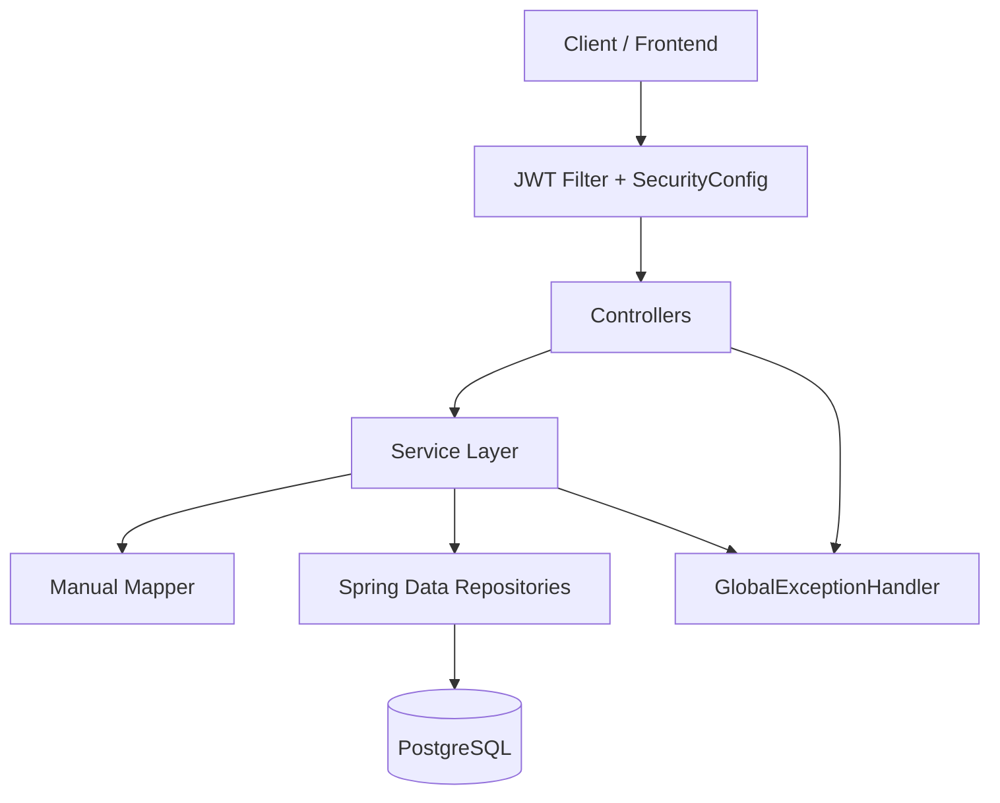

# Job Application Tracker API

Production-ready Spring Boot 3 REST API for tracking job applications with JWT authentication, role-based access, and PostgreSQL persistence.

## Features

- JWT authentication (`/api/auth/register`, `/api/auth/login`)
- Role-based authorization (`USER`, `ADMIN`)
- Job management endpoints:
  - `GET /api/jobs` (pagination, filtering, sorting)
  - `POST /api/jobs`
  - `PUT /api/jobs/{id}`
  - `DELETE /api/jobs/{id}`
- Ownership enforcement:
  - `USER` can access only own jobs
  - `ADMIN` can access all jobs
- Aggregation stats endpoint:
  - `GET /api/jobs/stats`
- Global exception handling
- OpenAPI/Swagger support
- Dockerized app + PostgreSQL stack

## Tech Stack

- Java 17
- Spring Boot 3.3.x
- Spring Security (JWT)
- Spring Data JPA / Hibernate
- PostgreSQL
- Maven
- Docker / Docker Compose
- JUnit 5, MockMvc, Mockito, JaCoCo

## Architecture Diagram



## Package Structure

```text
com.ibrahim.jobtracker
 ├── config
 ├── controller
 ├── service
 ├── service.impl
 ├── repository
 ├── dto
 ├── entity
 ├── exception
 ├── security
 └── util
```

## Environment Variables

Copy `.env.example` to `.env` and update values.

| Variable | Description | Default |
|---|---|---|
| `APP_PORT` | Host port mapped to API container | `8080` |
| `SERVER_PORT` | Internal Spring Boot server port | `8080` |
| `POSTGRES_PORT` | Host PostgreSQL port | `5432` |
| `POSTGRES_DB` | PostgreSQL DB name | `jobtracker` |
| `POSTGRES_USER` | PostgreSQL user | `jobtracker` |
| `POSTGRES_PASSWORD` | PostgreSQL password | `jobtracker` |
| `DB_HOST` | DB hostname for API | `postgres` |
| `DB_PORT` | DB port for API | `5432` |
| `DB_NAME` | DB name for API | `jobtracker` |
| `DB_USER` | DB user for API | `jobtracker` |
| `DB_PASSWORD` | DB password for API | `jobtracker` |
| `DB_POOL_MAX_SIZE` | Hikari max pool size | `20` |
| `DB_POOL_MIN_IDLE` | Hikari min idle | `5` |
| `SPRING_PROFILES_ACTIVE` | Spring profile | `prod` |
| `JWT_SECRET` | Base64 JWT secret (min 256-bit) | sample in `.env.example` |
| `JWT_EXPIRATION_MS` | JWT TTL in ms | `3600000` |
| `API_DOCS_ENABLED` | Enable `/v3/api-docs` | `true` |
| `SWAGGER_UI_ENABLED` | Enable Swagger UI | `true` |

## Local Setup

### Prerequisites

- Java 17
- Maven 3.9+
- Docker Desktop (or Docker Engine + Compose v2)

### Run with Docker Compose (Production Profile)

```bash
cp .env.example .env
docker compose up --build -d
docker compose ps
```

API: `http://localhost:8080`

### Stop Stack

```bash
docker compose down
```

### Reset DB Volume

```bash
docker compose down -v
docker compose up --build -d
```

### Run Locally without Docker (requires local PostgreSQL)

```bash
mvn clean test
mvn spring-boot:run -Dspring-boot.run.profiles=prod
```

## API Documentation

- Swagger UI: `http://localhost:8080/swagger-ui/index.html`
- OpenAPI JSON: `http://localhost:8080/v3/api-docs`

## Core API Endpoints

### Auth

- `POST /api/auth/register`
- `POST /api/auth/login`

### Jobs

- `GET /api/jobs?page=0&size=10&status=APPLIED&sort=desc`
- `GET /api/jobs/stats`
- `POST /api/jobs`
- `PUT /api/jobs/{id}`
- `DELETE /api/jobs/{id}`

## Deployment

### Render

1. Push repository to GitHub/GitLab.
2. Create a PostgreSQL service in Render.
3. Create a **Web Service** and choose Docker deployment (uses `Dockerfile`).
4. Configure environment variables in Render:
   - `SPRING_PROFILES_ACTIVE=prod`
   - `DB_HOST`, `DB_PORT`, `DB_NAME`, `DB_USER`, `DB_PASSWORD`
   - `JWT_SECRET`, `JWT_EXPIRATION_MS`
   - Optional: `API_DOCS_ENABLED`, `SWAGGER_UI_ENABLED`
5. Deploy and check logs.

### Railway

1. Create new project from GitHub repo.
2. Add PostgreSQL plugin.
3. Add API service from repo (Docker build).
4. Configure env vars:
   - `SPRING_PROFILES_ACTIVE=prod`
   - `DB_HOST`, `DB_PORT`, `DB_NAME`, `DB_USER`, `DB_PASSWORD`
   - `JWT_SECRET`, `JWT_EXPIRATION_MS`
5. Deploy and verify `/v3/api-docs`.

### VPS (Ubuntu) with Docker Compose

```bash
sudo apt update
sudo apt install -y ca-certificates curl gnupg
sudo install -m 0755 -d /etc/apt/keyrings
curl -fsSL https://download.docker.com/linux/ubuntu/gpg | sudo gpg --dearmor -o /etc/apt/keyrings/docker.gpg
echo \
  "deb [arch=$(dpkg --print-architecture) signed-by=/etc/apt/keyrings/docker.gpg] https://download.docker.com/linux/ubuntu \
  $(. /etc/os-release && echo $VERSION_CODENAME) stable" | sudo tee /etc/apt/sources.list.d/docker.list > /dev/null
sudo apt update
sudo apt install -y docker-ce docker-ce-cli containerd.io docker-buildx-plugin docker-compose-plugin
sudo usermod -aG docker $USER
```

After re-login:

```bash
git clone <your-repo-url>
cd job-application-tracker-api
cp .env.example .env
nano .env
docker compose up --build -d
docker compose logs -f app
```

## CI / Quality

```bash
mvn clean test
```

JaCoCo report is generated in:

`target/site/jacoco/index.html`

## Example Production Logs

```text
Tomcat initialized with port 8080 (http)
HikariPool-1 - Added connection org.postgresql.jdbc.PgConnection@...
Initialized JPA EntityManagerFactory for persistence unit 'default'
Tomcat started on port 8080 (http) with context path '/'
Started JobApplicationTrackerApiApplication in ... seconds
Database connectivity check passed. SELECT 1 returned 1
```
