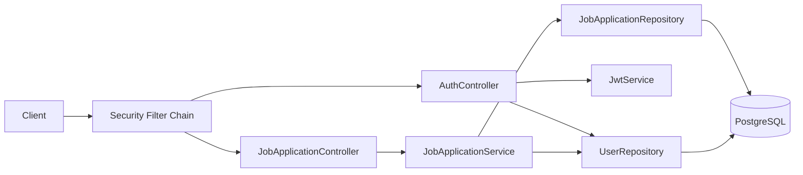

# Architecture

## Overview

This project follows a layered Spring Boot architecture:

- `controller` handles HTTP transport concerns.
- `service` and `service.impl` hold business rules and ownership checks.
- `repository` encapsulates data access through Spring Data JPA.
- `entity` defines persistence models and relationships.
- `dto` defines request/response contracts.
- `security` implements JWT authentication and authorization.
- `exception` centralizes API error handling.
- `util` contains manual mapping logic.

## High-Level Diagram

## Request Flow

1. Client sends request.
2. `JwtAuthenticationFilter` checks `Authorization: Bearer <token>`.
3. On valid token, Spring Security context is populated.
4. Controller validates request DTO and delegates to service.
5. Service enforces business rules:
   - User ownership for non-admin operations
   - Admin access for cross-user queries
6. Repository executes JPQL/derived queries.
7. Mapper converts entities to response DTOs.
8. `GlobalExceptionHandler` standardizes error responses.

## Data Model

### `users`
- Unique username and email.
- Role: `USER` or `ADMIN`.
- Audited timestamps (`created_at`, `updated_at`).

### `job_applications`
- Tracks company, position, status, applied date, notes.
- Many-to-one relation to `users`.
- Indexed fields for query performance.

## Security Model

- Stateless JWT auth.
- Open endpoints:
  - `POST /api/auth/register`
  - `POST /api/auth/login`
  - OpenAPI endpoints
- Protected endpoints:
  - `/api/jobs/**`
- Method-level and service-level ownership enforcement:
  - `USER`: own records only
  - `ADMIN`: full visibility

## Migrations Strategy

- Flyway migrations in `src/main/resources/db/migration`.
- Production profile uses:
  - `spring.jpa.hibernate.ddl-auto=validate`
  - Flyway for schema lifecycle

## Testing Strategy

- Unit tests for service, mapper, and JWT components.
- Integration tests for auth, CRUD, and stats endpoints.
- Persistence tests verify schema generation and relationships.

